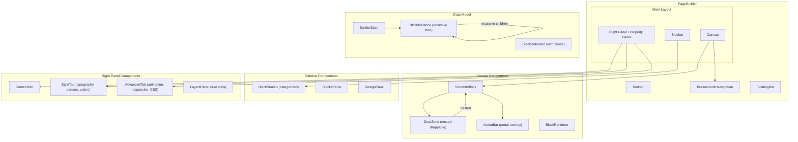

# Design Document: Page Builder UI Enhancement

## Overview

This design extends the existing page builder with nested block layouts, an enhanced sidebar search, a contextual action bar, breadcrumb navigation, a tabbed property panel with per-block style overrides, and improved visual polish. All components use HeroUI v3, Tailwind CSS v4, and dnd-kit — no Puck CSS modules or runtime dependencies are introduced.

The core architectural change is extending the flat `BlockInstance[]` model into a recursive tree where container blocks hold children in named zones. This unlocks multi-column layouts, nested sections, and a richer layers panel. The UI enhancements (action bar, breadcrumb, tabbed panel, search improvements) build on top of this tree model.

### Design Decisions & Rationale

| Decision | Rationale |
|---|---|
| Recursive `children` map on `BlockInstance` | Keeps the data model self-contained and serializable as a single JSON tree. Avoids a separate "zones" index table. |
| Zone names defined on `BlockDefinition` | Block authors declare zones statically (e.g., `["left", "right"]` for Columns). The canvas reads these to render `DropZone` components. |
| dnd-kit nested `useDroppable` for zones | dnd-kit already supports nested droppable regions. Each zone becomes a droppable with a compound ID (`parentId:zoneName`). |
| ActionBar as a portal-rendered overlay | Keeps the action bar outside the block's DOM flow so it doesn't affect layout. Repositions on scroll via `ResizeObserver` + scroll listeners, matching Puck's approach. |
| HeroUI `Tabs` for property panel | Reuses the existing HeroUI Tabs component for Content/Style/Advanced tabs, consistent with the project's component library. |
| HeroUI `Breadcrumbs` for nesting navigation | Uses the existing HeroUI Breadcrumbs component for ancestor path display. |
| `fast-check` for property-based testing | Already in devDependencies. Used for testing tree operations, serialization round-trips, and search logic. |

---

## Architecture



### Data Flow

1. **State**: `BuilderState` holds a recursive `BlockInstance[]` tree, selected block ID, and UI state.
2. **Selection**: Selecting a block stores its ID. A `getBlockPath(tree, id)` utility computes the ancestor chain for breadcrumbs and "select parent."
3. **Mutations**: All tree mutations (insert, delete, move, duplicate) operate on the recursive tree via pure helper functions. These are the core functions tested with property-based tests.
4. **Rendering**: The canvas recursively renders blocks. Container blocks render their zones as nested `DropZone` components. Each zone is a dnd-kit droppable.
5. **Serialization**: The entire tree serializes to JSON directly (it's already a plain object tree). Deserialization is `JSON.parse` with validation.

---

## Components and Interfaces

### Extended Block Types

```typescript
// types.ts — Extended types

/** A named drop zone definition for container blocks */
export interface ZoneDefinition {
  /** Zone identifier (e.g., "left", "right", "content") */
  name: string;
  /** Human-readable label for the zone */
  label: string;
  /** Block types allowed in this zone (empty = all allowed) */
  allow?: BlockType[];
}

/** Extended BlockDefinition with optional zones */
export interface BlockDefinition {
  type: BlockType;
  label: string;
  icon: string;
  category: BlockCategory;
  description: string;
  defaultProps: Record<string, unknown>;
  /** If present, this block is a container that supports nesting */
  zones?: ZoneDefinition[];
}

/** Extended BlockInstance with recursive children */
export interface BlockInstance {
  id: string;
  type: BlockType;
  props: Record<string, unknown>;
  /** 
   * Children organized by zone name.
   * Only present on container blocks.
   * Example: { left: [...], right: [...] }
   */
  children?: Record<string, BlockInstance[]>;
}

/** Per-block style overrides */
export interface BlockStyleOverrides {
  // Typography
  fontSize?: string;       // "sm" | "base" | "lg" | "xl" | "2xl" | "3xl" | "4xl" | custom
  fontWeight?: string;     // "light" | "normal" | "medium" | "semibold" | "bold"
  textAlign?: string;      // "left" | "center" | "right" | "justify"
  textColor?: string;      // hex or rgba
  lineHeight?: string;     // "tight" | "normal" | "relaxed" | "loose"
  // Borders
  borderWidth?: string;    // "0" | "1px" | "2px" | "4px"
  borderColor?: string;    // hex or rgba
  borderStyle?: string;    // "solid" | "dashed" | "dotted" | "none"
  borderRadius?: string;   // design token or per-corner
  borderRadiusTL?: string;
  borderRadiusTR?: string;
  borderRadiusBL?: string;
  borderRadiusBR?: string;
  // Background
  backgroundColor?: string;
  backgroundImage?: string;
  // Spacing
  paddingTop?: number;
  paddingBottom?: number;
  paddingLeft?: number;
  paddingRight?: number;
  marginTop?: number;
  marginBottom?: number;
  // Layout
  fullWidth?: boolean;
  // Animation
  animation?: string;
  animationDelay?: number;
  // CSS
  cssClass?: string;
  // Responsive visibility
  visibleDesktop?: boolean;  // default true
  visibleTablet?: boolean;   // default true
  visibleMobile?: boolean;   // default true
}

/** Responsive visibility config */
export interface ResponsiveVisibility {
  desktop: boolean;
  tablet: boolean;
  mobile: boolean;
}
```

### Tree Utility Functions

```typescript
// tree-utils.ts — Pure functions for tree operations

/** Find a block by ID in the recursive tree. Returns the block or null. */
export function findBlock(
  blocks: BlockInstance[],
  id: string
): BlockInstance | null;

/** Get the path (array of ancestor IDs) from root to a block. */
export function getBlockPath(
  blocks: BlockInstance[],
  id: string
): string[];

/** Get the parent block of a given block ID. Returns null for root-level blocks. */
export function getParentBlock(
  blocks: BlockInstance[],
  id: string
): { parent: BlockInstance; zone: string } | null;

/** Insert a block into a specific zone of a container, or at root level. */
export function insertBlock(
  blocks: BlockInstance[],
  newBlock: BlockInstance,
  targetParentId: string | null,
  targetZone: string | null,
  targetIndex: number
): BlockInstance[];

/** Remove a block from the tree by ID. */
export function removeBlock(
  blocks: BlockInstance[],
  id: string
): BlockInstance[];

/** Move a block from one position to another (same or different zone). */
export function moveBlock(
  blocks: BlockInstance[],
  blockId: string,
  targetParentId: string | null,
  targetZone: string | null,
  targetIndex: number
): BlockInstance[];

/** Duplicate a block, placing the copy immediately after the original. */
export function duplicateBlock(
  blocks: BlockInstance[],
  id: string
): BlockInstance[];

/** Check if `ancestorId` is an ancestor of `descendantId`. */
export function isAncestor(
  blocks: BlockInstance[],
  ancestorId: string,
  descendantId: string
): boolean;

/** Check if dropping `blockId` into `targetId` would create a cycle. */
export function wouldCreateCycle(
  blocks: BlockInstance[],
  blockId: string,
  targetId: string
): boolean;

/** Flatten the tree into a flat array with depth info (for layers panel). */
export function flattenTree(
  blocks: BlockInstance[],
  depth?: number
): Array<{ block: BlockInstance; depth: number; zone?: string; parentId?: string }>;

/** Serialize the block tree to JSON string. */
export function serializeTree(blocks: BlockInstance[]): string;

/** Deserialize a JSON string back to a block tree. Throws on invalid input. */
export function deserializeTree(json: string): BlockInstance[];
```

### ActionBar Component

```typescript
// components/ActionBar.tsx

interface ActionBarProps {
  block: BlockInstance;
  blockRef: HTMLElement | null;
  isNested: boolean;
  isDragging: boolean;
  onDuplicate: () => void;
  onDelete: () => void;
  onSelectParent: () => void;
}
```

The ActionBar renders as a portal attached to `document.body`. It reads the block element's bounding rect via `getBoundingClientRect()` and positions itself above the block. A `ResizeObserver` and scroll listener keep it in sync. It uses HeroUI `Button` components with `Tooltip` wrappers for actions.

**Structure:**
```
┌─────────────────────────────────────────┐
│ [↑ Parent]  Hero Block  │  [⧉] [🗑]   │
└─────────────────────────────────────────┘
```

- "Select Parent" button only visible when `isNested` is true
- Block label shown in the center
- Duplicate and Delete buttons on the right
- Hidden when `isDragging` is true
- z-index: 30 (below Toolbar at z-40, above canvas content)

### Breadcrumb Navigation

```typescript
// components/BreadcrumbNav.tsx

interface BreadcrumbNavProps {
  blocks: BlockInstance[];
  selectedBlockId: string | null;
  onSelectBlock: (id: string | null) => void;
}
```

Uses HeroUI `Breadcrumbs` component. Computes the ancestor path using `getBlockPath()`. Each breadcrumb item shows the block's label (from its definition). Clicking an ancestor selects that block. Only renders when the selected block is at depth > 1.

**Position:** Rendered between the Toolbar and the Canvas area, as a thin horizontal bar. Hidden when no nested block is selected.

### Enhanced BlockSearch

```typescript
// components/BlockSearch.tsx (enhanced)

interface BlockSearchProps {
  onBlockSelect?: (blockType: BlockType) => void;
}
```

Enhancements over current implementation:
1. **Categorized results**: Group matches by category with sticky category headers
2. **Keyboard hint**: Show "Press Esc to clear" when input is focused
3. **Result metadata**: Each result shows icon, label, description, and a category badge (HeroUI `Chip`)
4. **Draggable results**: Each result item uses `useDraggable` (already implemented)

The search algorithm remains case-insensitive substring matching across `label`, `type`, `description`, and `category` fields. Results are grouped using `Object.groupBy` or a reduce, then rendered with category headers.

### DropZone Component (for nested blocks)

```typescript
// components/DropZone.tsx

interface DropZoneProps {
  parentId: string;
  zone: string;
  children: BlockInstance[];
  design: DesignSettings;
  selectedBlockId: string | null;
  isDragActive: boolean;
  onBlockSelect: (id: string | null) => void;
  onBlockDelete: (id: string) => void;
}
```

Each DropZone is a dnd-kit `useDroppable` with ID `${parentId}:${zone}`. It renders its children as `SortableBlock` components within a `SortableContext`. When empty, it shows a dashed border placeholder with "Drop blocks here" text and a minimum height of 64px.

**Nested rendering flow:**
1. Canvas renders root-level blocks
2. If a block's definition has `zones`, the block renderer calls `<DropZone>` for each zone
3. Each DropZone renders its children, which may themselves be containers with zones
4. Maximum nesting depth is enforced at 2+ levels (no hard limit, but UI becomes impractical beyond 3-4)

### Tabbed Property Panel

```typescript
// components/RightPanel.tsx (enhanced)

// Tab state per block type, stored in a Map<BlockType, TabId>
type PropertyTab = "content" | "style" | "advanced";
```

Uses HeroUI `Tabs` component with three tabs:

1. **Content Tab**: Block-specific property fields (existing editors — text fields, item lists, rich text, image pickers)
2. **Style Tab**: Typography controls, border/radius controls, color pickers with presets, spacing (box model editor)
3. **Advanced Tab**: Animation settings, CSS class override, responsive visibility toggles, section layout options

Tab state is remembered per block type using a `Map<BlockType, PropertyTab>` stored in component state. Switching blocks of the same type preserves the last active tab.

### Enhanced Layers Panel

```typescript
// components/LayersPanel.tsx (enhanced)

interface LayersPanelProps {
  blocks: BlockInstance[];
  selectedBlockId: string | null;
  expandedIds: Set<string>;
  onToggleExpand: (id: string) => void;
  onSelect: (id: string) => void;
  onDelete: (id: string) => void;
  onMoveUp: (id: string) => void;
  onMoveDown: (id: string) => void;
  onDuplicate: (id: string) => void;
  onHover: (id: string | null) => void;
}
```

The layers panel uses `flattenTree()` to convert the recursive tree into a flat list with depth info. Each item is indented by `depth * 16px`. Container blocks show a chevron icon that toggles expand/collapse. Zone labels appear as section headers between groups of children.

**Visual enhancements:**
- Alternating subtle background tones (even/odd rows)
- Visibility indicator icon for blocks with disabled viewports
- Hover syncs with canvas highlight via `onHover` callback

---

## Data Models

### BlockInstance Tree Structure

```json
{
  "blocks": [
    {
      "id": "block-1",
      "type": "navbar",
      "props": { "logo": "Acme", "links": ["Features", "Pricing"] }
    },
    {
      "id": "block-2",
      "type": "columns",
      "props": { "count": 2 },
      "children": {
        "left": [
          {
            "id": "block-3",
            "type": "text",
            "props": { "content": "Left column content" }
          }
        ],
        "right": [
          {
            "id": "block-4",
            "type": "image",
            "props": { "src": "photo.jpg", "alt": "Photo" }
          }
        ]
      }
    },
    {
      "id": "block-5",
      "type": "footer",
      "props": { "copyright": "© 2026 Acme" }
    }
  ]
}
```

### Columns Block Definition (example container)

```typescript
{
  type: "columns",
  label: "Columns",
  icon: "▥",
  category: "layout",
  description: "Multi-column layout container",
  defaultProps: { count: 2 },
  zones: [
    { name: "left", label: "Left Column" },
    { name: "right", label: "Right Column" },
  ],
}
```

### Style Overrides Storage

Style overrides are stored in `block.props._style` as a `BlockStyleOverrides` object:

```json
{
  "id": "block-3",
  "type": "text",
  "props": {
    "content": "Hello world",
    "_style": {
      "fontSize": "xl",
      "fontWeight": "bold",
      "textAlign": "center",
      "textColor": "#634CF8",
      "borderWidth": "2px",
      "borderColor": "#e5e5e5",
      "borderStyle": "solid",
      "borderRadius": "lg",
      "visibleDesktop": true,
      "visibleTablet": true,
      "visibleMobile": false
    }
  }
}
```

### State Shape Changes

```typescript
// BuilderState additions
export interface BuilderState {
  blocks: BlockInstance[];           // Now a recursive tree
  design: DesignSettings;
  selectedBlockId: string | null;
  sidebarPanel: SidebarPanel;
  isDrawerOpen: boolean;
  previewMode: "desktop" | "tablet" | "mobile";
  hoveredBlockId: string | null;     // NEW: for layers ↔ canvas hover sync
  expandedLayerIds: Set<string>;     // NEW: for layers panel expand/collapse
}
```

---

## Correctness Properties

*A property is a characteristic or behavior that should hold true across all valid executions of a system — essentially, a formal statement about what the system should do. Properties serve as the bridge between human-readable specifications and machine-verifiable correctness guarantees.*

### Property 1: Block insertion places block in correct zone

*For any* valid block tree, any new block, and any valid target zone within a container block, inserting the block should result in the block appearing in exactly that zone's children array at the specified index, and no other zone should be modified.

**Validates: Requirements 1.3**

### Property 2: Select parent returns the correct ancestor

*For any* valid nested block tree and any block that has a parent, calling `getParentBlock` should return the block's immediate parent container and the zone name the block resides in.

**Validates: Requirements 1.6**

### Property 3: Circular nesting prevention

*For any* valid block tree and any container block within it, `wouldCreateCycle` should return `true` for all descendants of that container (preventing the container from being dropped into its own subtree), and `false` for all non-descendants.

**Validates: Requirements 1.8**

### Property 4: Serialization round-trip preserves tree

*For any* valid nested BlockInstance tree, serializing to JSON and then deserializing should produce a deeply equal tree.

**Validates: Requirements 2.3, 2.4, 2.5**

### Property 5: Search results grouped by category

*For any* non-empty search query and set of block definitions, all returned results should be grouped such that blocks of the same category appear consecutively, and every matching block appears exactly once.

**Validates: Requirements 3.2**

### Property 6: Case-insensitive substring matching

*For any* block definition and any substring extracted from its label, type, description, or category (with arbitrary case transformation applied), searching with that substring should include that block in the results.

**Validates: Requirements 3.5**

### Property 7: Duplicate inserts copy after original in same zone

*For any* valid block tree and any block within it, duplicating that block should result in a new block with a different ID appearing immediately after the original in the same parent zone (or root array), with the same type and props.

**Validates: Requirements 4.7**

### Property 8: Delete removes block and preserves tree integrity

*For any* valid block tree with at least one block, deleting a block by ID should result in a tree that no longer contains that ID, and all other blocks remain unchanged in their relative positions.

**Validates: Requirements 4.8**

### Property 9: Breadcrumb path matches actual ancestor chain

*For any* valid nested block tree and any block at depth > 1, the path returned by `getBlockPath` should be an ordered list of ancestor IDs from root to the block's parent, and each ID in the path should be a valid block that is an ancestor of the next.

**Validates: Requirements 7.1**

### Property 10: Tab switching preserves property values

*For any* block with properties set on the Content, Style, and Advanced tabs, switching between tabs should not modify any property values — the block's props object should remain deeply equal before and after tab switches.

**Validates: Requirements 11.5**

### Property 11: Style overrides applied to canvas rendering

*For any* block with style overrides (typography, border, or color settings), the rendered block element's computed style should reflect the specified overrides.

**Validates: Requirements 12.6, 13.6, 15.5**

### Property 12: Responsive visibility per viewport

*For any* block with a viewport toggle disabled, when the canvas preview mode matches that viewport, the block should not be visible (rendered with a hidden/overlay state). When the toggle is enabled, the block should be visible.

**Validates: Requirements 14.2**

### Property 13: Panel resize stays within bounds

*For any* sequence of resize drag deltas applied to the right panel, the resulting width should always be clamped between 280px (minimum) and 440px (maximum).

**Validates: Requirements 16.1**

---

## Error Handling

| Scenario | Handling |
|---|---|
| Circular nesting attempt | `wouldCreateCycle` check before drop. If true, the drop is rejected silently (no insertion indicator shown). |
| Invalid JSON during deserialization | `deserializeTree` throws a descriptive error. The UI catches it and shows a toast notification via HeroUI `Toast`. Falls back to empty block array. |
| Block ID not found in tree | `findBlock` returns `null`. Callers handle gracefully (e.g., `getParentBlock` returns `null` for root blocks). |
| Missing zone on container | If a block references a zone that doesn't exist in its definition, the zone is ignored during rendering. A console warning is logged in development. |
| Drag into non-container block | The block is not a valid drop target for nesting. Only root-level drop positions and container zones accept drops. |
| Style override with invalid value | Invalid CSS values are passed through to the style attribute. The browser ignores invalid values gracefully. A validation layer can be added later. |
| Responsive visibility — all viewports disabled | The block is hidden in all preview modes but remains in the tree. The layers panel shows a warning indicator. |
| localStorage quota exceeded | Existing `try/catch` in `saveToStorage` silently ignores quota errors. No change needed. |

---

## Testing Strategy

### Unit Tests (Example-Based)

Unit tests cover specific scenarios, edge cases, and UI rendering:

- **Tree operations**: Insert at root, insert into zone, insert at specific index, delete root block, delete nested block, move between zones
- **Edge cases**: Empty tree operations, single-block tree, maximum nesting depth, duplicate of container with children
- **UI rendering**: ActionBar positioning, breadcrumb visibility at root vs. nested, tab rendering, drop zone placeholder states
- **Search**: Empty query returns no results, exact match, partial match, no-match empty state
- **Responsive visibility**: Default all-visible state, single viewport hidden, all viewports hidden

### Property-Based Tests (fast-check)

Property-based tests verify universal properties across randomly generated inputs. Each test runs a minimum of **100 iterations**.

**Test configuration:**
- Library: `fast-check` (already in devDependencies)
- Runner: `vitest`
- Tag format: `Feature: page-builder-ui-enhancement, Property {N}: {title}`

**Properties to implement:**

1. **Property 1**: Block insertion into correct zone — generate random trees and insertions
2. **Property 2**: Select parent correctness — generate random trees, pick random nested blocks
3. **Property 3**: Circular nesting prevention — generate random trees, test all ancestor/descendant pairs
4. **Property 4**: Serialization round-trip — generate random trees with varying depth/zones
5. **Property 5**: Search grouping by category — generate random block definitions and queries
6. **Property 6**: Case-insensitive substring matching — generate random definitions and substrings
7. **Property 7**: Duplicate placement — generate random trees, duplicate random blocks
8. **Property 8**: Delete preserves integrity — generate random trees, delete random blocks
9. **Property 9**: Breadcrumb path correctness — generate random trees, verify ancestor chains
10. **Property 10**: Tab switching preserves values — generate random prop objects, simulate tab switches
11. **Property 11**: Style overrides applied — generate random style objects, verify computed styles
12. **Property 12**: Responsive visibility — generate random visibility configs, verify hide/show
13. **Property 13**: Panel resize bounds — generate random drag deltas, verify clamping

**Custom generators:**

```typescript
// test/generators.ts
import * as fc from "fast-check";

/** Generate a random BlockInstance tree with configurable max depth */
export const arbBlockTree = (maxDepth: number = 3): fc.Arbitrary<BlockInstance[]> => { ... };

/** Generate a random BlockInstance (leaf) */
export const arbLeafBlock: fc.Arbitrary<BlockInstance> = { ... };

/** Generate a random container BlockInstance with children */
export const arbContainerBlock = (maxDepth: number): fc.Arbitrary<BlockInstance> => { ... };

/** Generate a random search query (substring of a block field) */
export const arbSearchQuery: fc.Arbitrary<string> = { ... };

/** Generate random BlockStyleOverrides */
export const arbStyleOverrides: fc.Arbitrary<BlockStyleOverrides> = { ... };
```

### Integration Tests

- **Drag-and-drop flow**: Drag a block from sidebar into a container zone, verify tree update
- **Full editing flow**: Select block → edit in Content tab → switch to Style tab → apply typography → verify canvas rendering
- **Serialization persistence**: Build a nested page → save → reload → verify structure matches
