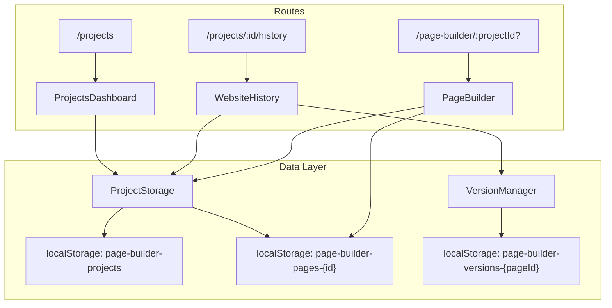

# Design Document: Project Dashboard

## Overview

This feature introduces a **Project** abstraction layer on top of the existing `PagesState` model, along with two new views: a Projects Dashboard (`/projects`) and a Website History view (`/projects/:id/history`). Currently the app operates on a single implicit project stored in localStorage. This design promotes that to a first-class `Project` entity with its own registry, enabling users to manage multiple websites from a central dashboard and browse cross-page version history for any project.

The implementation stays entirely client-side using localStorage, reuses the existing `VersionManager` and `PagesState` infrastructure, and follows the app's established patterns with HeroUI v3 components, lucide-react icons, and Tailwind CSS.

### Key Design Decisions

1. **Project as a wrapper around PagesState**: A `Project` is a lightweight metadata record (id, name, timestamps) whose pages are stored in a separate localStorage key using the existing `PagesState` shape. This avoids migrating the current storage format and keeps per-project data isolated.

2. **Registry pattern for localStorage**: A single `page-builder-projects` key holds an array of `ProjectMeta` records. Each project's pages live at `page-builder-pages-{projectId}` and versions at `page-builder-versions-{pageId}` (unchanged). This keeps storage keys predictable and avoids a single massive JSON blob.

3. **Backward compatibility**: On first load of the dashboard, a migration function checks for the legacy `page-builder-pages` key and, if found, wraps it into a new project entry so existing users don't lose their work.

4. **Route structure**: `/projects` for the dashboard, `/projects/:id/history` for history, and `/page-builder/:projectId?` for the editor. The editor route uses an optional param so the existing `/page-builder` URL still works (loading the first available project or creating one).

## Architecture



### Data Flow

1. **Dashboard load**: `ProjectStorage.listProjects()` reads the registry from localStorage, returns `ProjectMeta[]`. Each `ProjectCard` derives its display data (page count, status, last updated) from the associated `PagesState`.

2. **Open editor**: User clicks "Edit" on a card → navigates to `/page-builder/{projectId}`. `PageBuilder` reads `projectId` from `useParams()`, calls `ProjectStorage.loadProjectPages(projectId)` to get the `PagesState`, and initializes as before.

3. **View history**: User clicks "History" → navigates to `/projects/{id}/history`. `WebsiteHistory` loads all page IDs for the project, then calls `VersionManager.getVersions(pageId)` for each page, merges and sorts the results.

4. **Create project**: Dashboard "New Project" flow creates a `ProjectMeta` entry and a default `PagesState` with one home page, then navigates to the editor.

5. **Delete project**: Removes the `ProjectMeta` from the registry, deletes the `page-builder-pages-{id}` key, and deletes all `page-builder-versions-{pageId}` keys for that project's pages.

## Components and Interfaces

### New Components

#### `ProjectsDashboard`
- **Location**: `src/pages/projects.tsx`
- **Responsibility**: Top-level page for `/projects` route. Renders the project grid, empty state, and "New Project" action.
- **Props**: None (route component)
- **State**: `projects: ProjectMeta[]`, `isCreateModalOpen: boolean`
- **Uses**: `ProjectStorage`, `ProjectCard`, HeroUI `Button`, `Modal`, `Input`

#### `ProjectCard`
- **Location**: `src/page-builder/components/ProjectCard.tsx`
- **Responsibility**: Renders a single project as a card with title, status badge, page count, relative timestamp, and action buttons (Edit, History, Delete).
- **Props**:
  ```typescript
  interface ProjectCardProps {
    project: ProjectMeta;
    pagesState: PagesState;
    onEdit: (projectId: string) => void;
    onHistory: (projectId: string) => void;
    onDelete: (projectId: string) => void;
  }
  ```
- **Uses**: HeroUI `Card`, `CardBody`, `CardFooter`, `Button`, `Chip`, lucide-react icons

#### `WebsiteHistory`
- **Location**: `src/pages/project-history.tsx`
- **Responsibility**: Top-level page for `/projects/:id/history`. Loads all versions across all pages, renders the timeline with filtering and comparison.
- **Props**: None (route component, reads `id` from `useParams()`)
- **State**: `versions: VersionSnapshot[]`, `pageFilter: string | null`, `compareSelection: string[]`, `showDiff: boolean`
- **Uses**: `ProjectStorage`, `VersionManager`, `HistoryTimeline`, `VersionComparisonView`

#### `HistoryTimeline`
- **Location**: `src/page-builder/components/HistoryTimeline.tsx`
- **Responsibility**: Renders a vertical timeline of version snapshots with page labels, timestamps, change summaries, tags, and action buttons (Restore, Compare checkbox).
- **Props**:
  ```typescript
  interface HistoryTimelineProps {
    versions: VersionSnapshot[];
    pages: Page[];
    compareSelection: string[];
    onToggleCompare: (versionId: string) => void;
    onRestore: (version: VersionSnapshot) => void;
  }
  ```
- **Uses**: HeroUI `Chip`, `Button`, lucide-react icons

#### `CreateProjectModal`
- **Location**: `src/page-builder/components/CreateProjectModal.tsx`
- **Responsibility**: Modal dialog for entering a new project name with validation.
- **Props**:
  ```typescript
  interface CreateProjectModalProps {
    isOpen: boolean;
    onClose: () => void;
    onCreate: (name: string) => void;
  }
  ```
- **Uses**: HeroUI `Modal`, `ModalContent`, `ModalHeader`, `ModalBody`, `ModalFooter`, `Input`, `Button`

#### `DeleteConfirmModal`
- **Location**: `src/page-builder/components/DeleteConfirmModal.tsx`
- **Responsibility**: Confirmation dialog before deleting a project.
- **Props**:
  ```typescript
  interface DeleteConfirmModalProps {
    isOpen: boolean;
    projectName: string;
    onClose: () => void;
    onConfirm: () => void;
  }
  ```

### Modified Components

#### `App.tsx`
- Add routes: `/projects`, `/projects/:id/history`, update `/page-builder` to `/page-builder/:projectId?`

#### `PageBuilder.tsx`
- Read `projectId` from `useParams()`. Use `ProjectStorage.loadProjectPages(projectId)` instead of `loadPages()`. Save via `ProjectStorage.saveProjectPages(projectId, state)` instead of `savePages()`.

### New Module

#### `ProjectStorage`
- **Location**: `src/page-builder/project-storage.ts`
- **Responsibility**: All CRUD operations for the project registry and per-project pages in localStorage.
- **Interface**:
  ```typescript
  class ProjectStorage {
    static listProjects(): ProjectMeta[];
    static getProject(id: string): ProjectMeta | null;
    static createProject(name: string): ProjectMeta;
    static deleteProject(id: string): void;
    static updateProject(id: string, updates: Partial<Pick<ProjectMeta, 'name'>>): ProjectMeta | null;
    static loadProjectPages(projectId: string): PagesState;
    static saveProjectPages(projectId: string, state: PagesState): void;
    static migrateFromLegacy(): void;
  }
  ```

### Utility Function

#### `formatRelativeTime`
- **Location**: `src/page-builder/utils/format-time.ts`
- **Responsibility**: Converts an ISO timestamp to a human-readable relative string (e.g., "2 hours ago", "3 days ago"). Pure function, no dependencies.
- **Signature**: `(isoTimestamp: string) => string`

## Data Models

### `ProjectMeta`

```typescript
interface ProjectMeta {
  id: string;          // Unique ID, e.g., "proj-1718000000000"
  name: string;        // User-assigned project name
  createdAt: string;   // ISO 8601 timestamp
  updatedAt: string;   // ISO 8601 timestamp (updated on any page save)
}
```

### `ProjectsRegistry`

```typescript
interface ProjectsRegistry {
  projects: ProjectMeta[];
}
```

**Storage key**: `page-builder-projects`

### Per-Project Pages

Each project's pages are stored at key `page-builder-pages-{projectId}` using the existing `PagesState` shape:

```typescript
interface PagesState {
  pages: Page[];
  activePageId: string;
}
```

### Per-Page Versions (unchanged)

Versions remain at `page-builder-versions-{pageId}` using the existing `VersionManager` storage format. No changes needed since page IDs are already globally unique (timestamp-based).

### localStorage Key Map

| Key | Shape | Description |
|-----|-------|-------------|
| `page-builder-projects` | `ProjectsRegistry` | Registry of all projects |
| `page-builder-pages-{projectId}` | `PagesState` | Pages for a specific project |
| `page-builder-versions-{pageId}` | `VersionHistoryStorage` | Version history per page (existing) |
| `page-builder-pages` | `PagesState` | Legacy key (migrated on first dashboard load) |
| `page-builder-state` | `{ blocks, design }` | Legacy editor state (existing) |

### Migration Strategy

On first call to `ProjectStorage.listProjects()`, if the registry key doesn't exist:
1. Check for legacy `page-builder-pages` key
2. If found, create a `ProjectMeta` with name derived from the first page's title (or "My Website")
3. Move the `PagesState` to `page-builder-pages-{newProjectId}`
4. Save the new registry
5. Remove the legacy key


## Correctness Properties

*A property is a characteristic or behavior that should hold true across all valid executions of a system — essentially, a formal statement about what the system should do. Properties serve as the bridge between human-readable specifications and machine-verifiable correctness guarantees.*

### Property 1: Dashboard renders one card per project

*For any* list of `ProjectMeta` entries stored in the registry, the dashboard should render exactly as many `ProjectCard` components as there are entries in the list, including zero cards when the list is empty (showing the empty state instead).

**Validates: Requirements 1.2, 1.3**

### Property 2: ProjectCard displays correct derived data

*For any* project with any set of pages (each with random `settings.title`, `settings.published`, and `settings.updatedAt` values), the `ProjectCard` should display:
- The project name as the title (falling back to the first page's `settings.title` if the project name is empty)
- "Published" status if at least one page has `settings.published === true`, "Draft" otherwise
- The exact count of pages in the project
- A relative time string corresponding to the maximum `settings.updatedAt` across all pages

**Validates: Requirements 2.1, 2.2, 2.3, 2.4**

### Property 3: Card action URLs contain the correct project ID

*For any* project with a given ID, the "Edit" action should produce a navigation URL of `/page-builder/{projectId}` and the "History" action should produce a navigation URL of `/projects/{projectId}/history`.

**Validates: Requirements 3.1, 3.2**

### Property 4: Project deletion removes all associated data

*For any* project, after confirmed deletion, the project should no longer appear in `ProjectStorage.listProjects()`, the `page-builder-pages-{projectId}` key should not exist in localStorage, and all `page-builder-versions-{pageId}` keys for that project's pages should not exist in localStorage.

**Validates: Requirements 3.4, 3.5**

### Property 5: Valid project creation produces a project with a default home page

*For any* non-empty, non-whitespace project name, calling `ProjectStorage.createProject(name)` should produce a `ProjectMeta` with that name, and `ProjectStorage.loadProjectPages(id)` should return a `PagesState` containing exactly one page with a non-empty ID and a `settings.title` of "Home".

**Validates: Requirements 4.3**

### Property 6: Empty or whitespace project names are rejected

*For any* string composed entirely of whitespace characters (including the empty string), the project creation validation should reject the input and no new project should be added to the registry.

**Validates: Requirements 4.4**

### Property 7: Timeline versions are ordered newest-first

*For any* project with any number of pages each having any number of version snapshots, the merged timeline should be sorted such that for every consecutive pair of entries, the earlier entry's timestamp is greater than or equal to the later entry's timestamp.

**Validates: Requirements 6.1**

### Property 8: Timeline entries display all required information

*For any* version snapshot in the timeline, the rendered entry should include the page title (from the associated page), the change summary description, a formatted timestamp, any associated tags, and if `parentVersionId` is non-null, a restoration indicator.

**Validates: Requirements 6.2, 6.3**

### Property 9: Page filter shows only matching versions

*For any* project with multiple pages and any selected page filter value, all versions displayed in the filtered timeline should have a `pageId` equal to the selected page's ID. Furthermore, clearing the filter should restore the full unfiltered list with the same total count as before filtering.

**Validates: Requirements 7.2, 7.3**

### Property 10: Version restoration updates page state and grows the timeline

*For any* version snapshot in a project's history, restoring it should result in the corresponding page's current blocks, design, and settings matching the snapshot's values, and the total version count for that page should increase (by the entries created during the restore operation).

**Validates: Requirements 8.3, 8.4**

## Error Handling

### localStorage Errors

- **Quota exceeded**: All `ProjectStorage` write operations wrap `localStorage.setItem` in try/catch. On failure, the operation returns gracefully and the UI displays a toast notification ("Storage full — unable to save").
- **Corrupted data**: `JSON.parse` calls are wrapped in try/catch. If the registry or a project's pages fail to parse, the function returns a safe default (empty array or default `PagesState`).
- **Missing keys**: `getItem` returning `null` is handled as "no data" — the dashboard shows the empty state, the editor creates a fresh project.

### Route Errors

- **Invalid project ID**: `WebsiteHistory` and `PageBuilder` check if the project exists via `ProjectStorage.getProject(id)`. If `null`, they render an error message with a link back to `/projects`.
- **Missing route param**: The `projectId` param on `/page-builder/:projectId?` is optional. If absent, the editor loads the most recently updated project or creates a new one.

### Migration Errors

- **Legacy data corruption**: If the legacy `page-builder-pages` key contains invalid JSON, migration skips it silently and starts with an empty registry. The corrupted key is not deleted so the user doesn't lose data permanently.

### Deletion Errors

- **Partial cleanup**: If deleting version history keys fails (e.g., one key throws), the project is still removed from the registry. Orphaned version keys are harmless and will be ignored.

### Version Restoration Errors

- **Restore failure**: If `VersionManager.restoreVersion` returns `null` (version not found), the UI displays an error message: "Unable to restore — version not found." The page state remains unchanged.

## Testing Strategy

### Unit Tests

Unit tests cover specific examples, edge cases, and integration points:

- **ProjectStorage CRUD**: Create a project, verify it appears in `listProjects()`. Delete it, verify it's gone. Update name, verify the change persists.
- **Migration**: Seed legacy `page-builder-pages` key, call `migrateFromLegacy()`, verify a project is created and the legacy key is removed.
- **Empty state**: No projects in storage → `listProjects()` returns `[]`.
- **Invalid project ID**: `getProject("nonexistent")` returns `null`.
- **formatRelativeTime**: Specific timestamp inputs → expected output strings (e.g., 30 seconds ago, 2 hours ago, 3 days ago).
- **Edge cases**: Project with zero pages (shouldn't happen but handle gracefully), project name with special characters, very long project names.

### Property-Based Tests

Property-based tests use `fast-check` (already in devDependencies) with a minimum of 100 iterations per property. Each test references its design document property.

- **Property 1**: Generate random arrays of `ProjectMeta`, verify card count matches.
  - Tag: `Feature: project-dashboard, Property 1: Dashboard renders one card per project`
- **Property 2**: Generate random projects with random page arrays, verify derived title/status/count/timestamp.
  - Tag: `Feature: project-dashboard, Property 2: ProjectCard displays correct derived data`
- **Property 3**: Generate random project IDs, verify URL construction.
  - Tag: `Feature: project-dashboard, Property 3: Card action URLs contain the correct project ID`
- **Property 4**: Generate random projects, create them, delete them, verify complete cleanup.
  - Tag: `Feature: project-dashboard, Property 4: Project deletion removes all associated data`
- **Property 5**: Generate random non-empty strings, create projects, verify structure.
  - Tag: `Feature: project-dashboard, Property 5: Valid project creation produces a project with a default home page`
- **Property 6**: Generate random whitespace-only strings, verify rejection.
  - Tag: `Feature: project-dashboard, Property 6: Empty or whitespace project names are rejected`
- **Property 7**: Generate random version snapshot arrays with random timestamps, verify sort order after merge.
  - Tag: `Feature: project-dashboard, Property 7: Timeline versions are ordered newest-first`
- **Property 8**: Generate random version snapshots with random fields, verify all required fields appear in rendered output.
  - Tag: `Feature: project-dashboard, Property 8: Timeline entries display all required information`
- **Property 9**: Generate random multi-page projects with versions, apply filter, verify all results match.
  - Tag: `Feature: project-dashboard, Property 9: Page filter shows only matching versions`
- **Property 10**: Generate random version snapshots, perform restore, verify page state matches and version count grows.
  - Tag: `Feature: project-dashboard, Property 10: Version restoration updates page state and grows the timeline`

### Test Configuration

- Library: `fast-check` v4.x (already installed)
- Runner: `vitest` (already configured)
- Minimum iterations: 100 per property test
- Each property test MUST be implemented as a single `fc.assert(fc.property(...))` call
- Each property test MUST include a comment referencing the design property number and text
